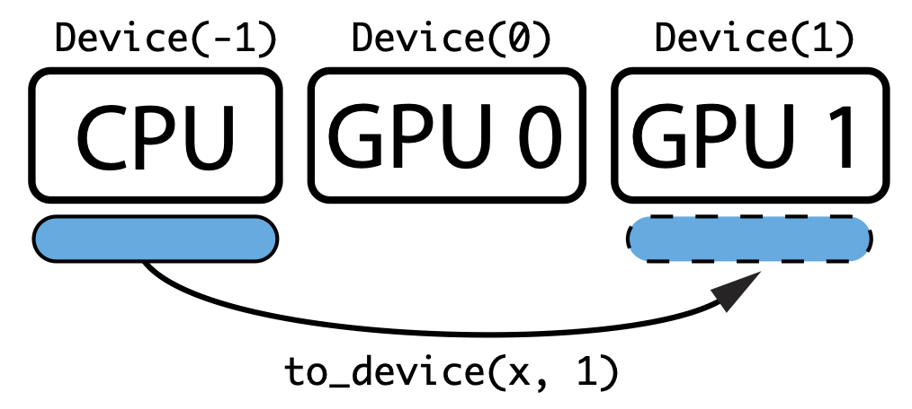

**This guide is still under construction**

Basic Usage
-----------

SigPy is designed to have as little learning curve as possible. Since almost all Python users already use NumPy, SigPy operates on NumPy arrays directly on CPU, and avoids defining any redundant functions.  When NumPy implementation is slow, SigPy uses Numba instead to translate Python functions to optimized machine code at runtime. For example, gridding functions in SigPy are implemented using Numba. For GPU, SigPy operates on CuPy arrays, which have the same interface as NumPy but are implemented in CUDA. 

SigPy does not bundle CuPy installation by default.
To enable CUDA support, you must install CuPy as an additional step.

While we try to make this documentation as self-contained as possible,
we refer you to the `NumPy documentation <https://docs.scipy.org/doc/numpy/index.html>`_,
and `CuPy documentation <https://docs-cupy.chainer.org/en/latest/index.html>`_
for general questions about NumPy/CuPy arrays and functions.

In the following, we will use the following abbreviations:

>>> import numpy as np
>>> import cupy as cp
>>> import sigpy as sp

Choosing Computing Device
=========================

SigPy provides a device class :class:`sigpy.Device` to allow you to specify the current computing device for functions and arrays.
It extends the ``Device`` class from CuPy.
Similar approach is also used by machine learning packages, such as TensorFlow, and PyTorch.

For example to create an array on GPU 1, we can do:

>>> with sp.Device(1):
>>>     x_on_gpu1 = cp.array([1, 2, 3, 4])

Note that this can also be done with ``cupy.cuda.Device``, and you can choose to use it as well.
The main difference is that :class:`sigpy.Device` maps -1 to CPU, and makes it easier to develop CPU/GPU generic code.

To transfer an array between device, we can use :class:`sigpy.to_device`. For example, to transfer a numpy array to GPU 1, we can do:

>>> x = np.array([1, 2, 3, 4])
>>> x_on_gpu1 = sp.to_device(x, 1)

Finally, we can use :func:`sigpy.Device.xp` to choose NumPy or CuPy adaptively.
For example, given a device id,
the following code creates an array on the appropriate device using the appropriate module:

>>> device = Device(id)
>>> xp = device.xp  # Returns NumPy if id == -1, otherwise returns CuPy
>>> with device:
>>>    x = xp.array([1, 2, 3, 4])
