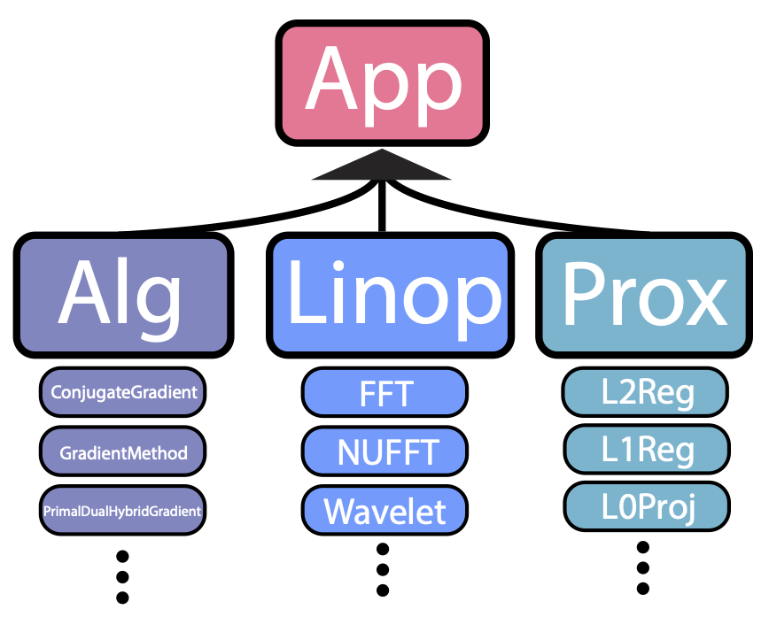

Building iterative methods
==========================

SigPy provides four abstraction classes (Linop, Prox, Alg, and App) for optimization based iterative methods. Such abstraction is inspired by similar structure in BART.

The Linop class abstracts a linear operator, and supports adjoint, addition, composing, and stacking. Prepackaged Linops include FFT, NUFFT, and wavelet, and common array manipulation functions. In particular, given a Linop ``A``, the following operations can be performed:

>>> A.H  # adjoint
>>> A.H * A  # compose
>>> A.H * A + lamda * I  # addition and scalar multiplication
>>> Hstack([A, B])  # horizontal stack
>>> Vstack([A, B])  # vertical stack
>>> Diag([A, B])  # diagonal stack

The Prox class abstracts a proximal operator, and can do stacking and conjugation. Prepackaged Proxs include L1/L2 regularization and projection functions. In particular, given a proximal operator ``proxg``, the following operations can be performed:

>>> Conj(proxg)  # convex conjugate
>>> UnitaryTransform(proxg, A)  # A.H * proxg * A
>>> Stack([proxg1, proxg2])  # diagonal stack

The Alg class abstracts iterative algorithms. Prepackaged Algs include conjugate gradient, (accelerated/proximal) gradient method, and primal dual hybrid gradient. A typical usage is as follows:

>>> while not alg.done():
>>>     alg.update()

Finally, the App class wraps the above three classes into a final deliverable application. Users can run an App without knowing the internal implementation. A typical usage of an App is as follows:

>>> out = app.run()
