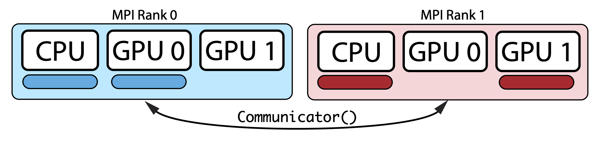

**This guide is still under construction**

Using Multi-CPU/GPU
-------------------

SigPy uses MPI and MPI4Py for multi-CPU/GPU programming. We note that this is still under heavy development.

Although MPI may incur some overhead (for example redundant memory usage) for shared memory system,
we find an MPI solution to be the simplest for multi-threading in Python.
Another benefit is that an MPI parallelized code can run on both shared memory and distributed memory systems.

For example, if we consider the following shared memory configuration (one multi-core CPU and two GPUs),
and want to run the blue and red tasks concurrently:

.. image:: figures/multiprocess_desired.png
   :align: center

Then, using MPI, we can split the tasks to two MPI nodes as follows:

Note that tasks on each MPI node can run on any CPU/GPU device, and in our example, the blue task uses CPU and GPU 0, and
the red task uses CPU and GPU 1.

SigPy provides a communicator class :class:`sigpy.Communicator` that can be used to synchronize variables between ranks.
It extends the ``Communicator`` class from ChainerMN.
